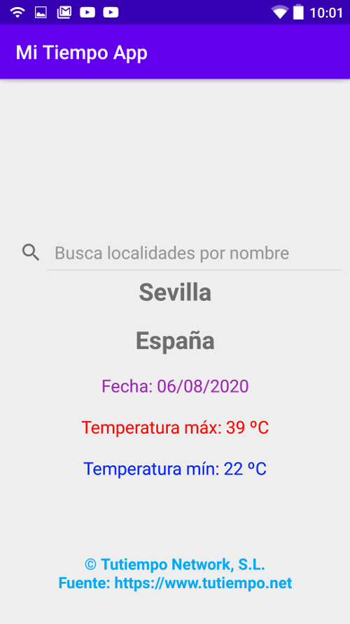

# MiTiempoApp-MVI-Hilt

    

Sencilla aplicación para android que da la previsión de temperaturas en localidades de todo el mundo (en español como lenguaje de entrada/presentación), cuyo nombre es ingresado en el cuadro texto ([1](#nota1)). Arranca la aplicación mostrando la predicción térmica de la ciudad de Sevilla, ES.

### Ejemplo de patrón MVI / Repository

------------

Esta app sirve de plantilla para el aprendizaje de la **arquitectura MVI** con **Repository**, **Livedata**, **Dagger/Hilt** (recientemente incorporado a Android), **Coroutines/Flow** ([2](#nota2)) y **Fragment** con **Navigation component**, siendo util para principiantes en Kotlin/Android que se adentran en la [Clean Architecture](https://devexperto.com/clean-architecture-android/ "Clean Architecture").

La aplicación recupera de la red los datos necesarios desde una **REST API** (https://api.tutiempo.net/; es trivial cambiar el patrón de búsqueda para recuperar los datos de poblaciones con entrada/salida en otras lenguas), los guarda en la base de datos y los vuelve a recuperar seguidamente de la misma (fuente única de confianza), mostrando durante el proceso una barra de progreso; al terminar muestra los datos en la UI, quedando lista para una nueva búsqueda.

### Referencias (Clean Architecture, MVI, Hilt, Coroutines/Flow, Navigation component):

------------
***Captura de pantalla del dispositivo***:

***Esquema de una Clean Architecuture***:

***Esquema en capas de una Clean Architecture***:

***Esquema del MVI pattern***:

- [Hilt](https://developer.android.com/training/dependency-injection/hilt-android "Hilt")
- MVI pattern:
	1. 	[Raywenderlich-MVI pattern](https://www.raywenderlich.com/817602-mvi-architecture-for-android-tutorial-getting-started "Raywenderlich")
	2. 	[Proandroiddev](https://proandroiddev.com/android-unidirectional-state-flow-without-rx-596f2f7637bb "Proandroiddev")
- [Navigation component](https://developer.android.com/guide/navigation/navigation-getting-started "Navigation component")
- Coroutines con Flow:
	1. [Medium - Flow(I)](https://medium.com/kotlin-en-android/coroutines-con-kotlin-flow-i-estructura-din%C3%A1mica-restricciones-y-operadores-527255579199)
	2. [Medium - Flow(II)](https://medium.com/kotlin-en-android/coroutines-con-kotlin-flow-ii-operadores-personalizados-y-manejo-de-excepciones-ba74c9f5ecbc)
	3. [Raywenderlich-Kotlin Flow for Android](https://www.raywenderlich.com/9799571-kotlin-flow-for-android-getting-started)
	4. [kotlinlang.org - Flow](https://kotlinlang.org/docs/reference/coroutines/flow.html)
	5. [kotlin.github.io - Flow](https://kotlin.github.io/kotlinx.coroutines/kotlinx-coroutines-core/kotlinx.coroutines.flow/-flow/)
- Clean Architecture:
	1. [Devexperto](https://devexperto.com/clean-architecture-android/ "Devexperto")
	2. [Raywenderlich-CLEAN ARCHITECTURE](https://www.raywenderlich.com/3595916-clean-architecture-tutorial-for-android-getting-started "Raywenderlich")

#### Notas:

------------

Esta muestra/plantilla es fácilmente modificable en relación a una mejora de su UI (que es minimalista), una presentación de un mayor número de datos procedente de la **REST API** o un mejor modelado de los mensajes de error, por ejemplo.

------------

(<a name="nota1">1</a>) El método getFromLocationName del objeto Geocoder de Android da la latitud y la longitud dado el nombre de una población. En este caso, la API dará la información de la localidad más cercana de la que se disponga de datos. Hay que tener en cuenta que, si no se tienen datos a menos de 30 km del punto referenciado con las coordenadas proporcionadas por getFromLocationName, la salida dará un error.

(<a name="nota2">2</a>) En la branch **«exception_handling_in_coroutines-flow»** se hace un manejo adecuado de las excepciones: en el bloque flow del método **execute()** de la clase **GetForecasts** no se capturan las exepciones, si no que se deja que se propaguen y son capturadas en el método **setStateEvent()** de la clase **MainViewModel**. Ver: [Restricción de «transparencia para las excepciones»](https://kotlin.github.io/kotlinx.coroutines/kotlinx-coroutines-core/kotlinx.coroutines.flow/-flow/#exception-transparency "Restricción de «transparencia para las excepciones»").
